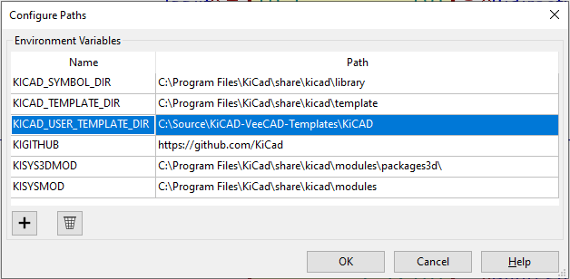

# KiCAD-VeeCAD-Templates

A store for custom templates created for KiCAD, VeeCAD or other such tool.

Source is attributed if not developed by me.

## Templates Included

### KiCAD

`Display.lib`

| Component       | Value           | Eeschema Symbol | PCB Footprint |
| --------------- | --------------- | :-------------: | :-----------: |
| OLED I2C Module | OLED_128x64_I2C |       Yes       |      No       |

`ESP32-DEVKITC.lib` [From SnapEDA](https://www.snapeda.com/parts/ESP32-DEVKITC-32D-F/Espressif%20Systems/view-part/?ref=dk&t=esp-32s&con_ref=None)

| Component       | Value         | Eeschema Symbol | PCB Footprint |
| --------------- | ------------- | :-------------: | :-----------: |
| NodeMCU ESP-32S | ESP32-DEVKITC |       Yes       |      Yes      |

### VeeCAD

`General-Lib.per`

| Outline         | Description                                  |
| --------------- | -------------------------------------------- |
| AAA_CELL_HOLDER | Single AAA plastic cell holder.              |
| DIP30           | 0.6" wide 30 pin DIP (ArduinoNano)           |
| PIEZO_03x06     | Piezo speaker, pin spacing .3", diameter .6" |
| PIEZO_04x09     | Piezo speaker, pin spacing .4", diameter .9" |
| SSD1306         | 0.96" OLED module with 4 pins (I2C)          |
| TACT_2_PIN      | PCB momentary push switch.                   |

## KiCAD Custom Library Configuration

Configure the KICAD\_USER\_TEMPLATE\_DIR variable to point to the KiCAD folder in this repository.

From Symbol Editor app, use menu Preferences / Configure Paths...

Update the Path for the KICAD\_USER\_TEMPLATE\_DIR entry:

## External Links

**KiCAD**
[https://kicad.org/](https://kicad.org/)

**VeeCAD**
[https://veecad.com/](https://veecad.com/)
